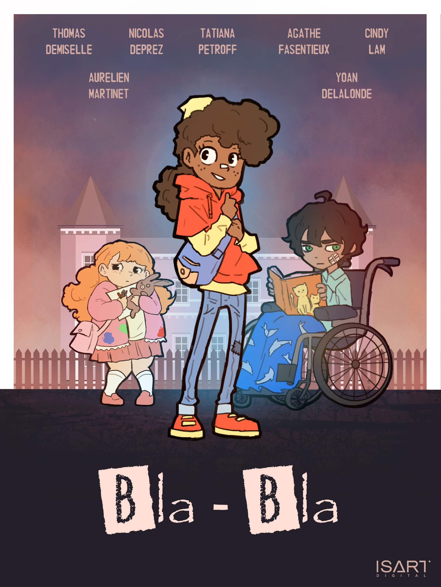

# BLA-BLA

Narrative game made with Game Design, Game Art and Sound Design students using Unity | 1 week

The project has been developed as a school assignment of [ISART Digital](https://www.isart.fr/) the project is then theirs and the authors property.

___

___
Here are the students who worked on this project
| Name | Role|
|:---:|:---:|
| DELALONDE Yoan | Game Designer
| DEMISELLE Thomas | Game Designer
| DEPREZ Nicolas | Game Programmer
| PETROFF Tatiana | Game Artist
| FASENTIEUX Agathe | Game Artist
| LAM Cindy | Game Artist
| MARTINET Aurélien | Sound Designer

# Techs

The project has been developed under Unity 2019.4.0f1

# How to Build

Launch the project with Unity 2019.4.0f1